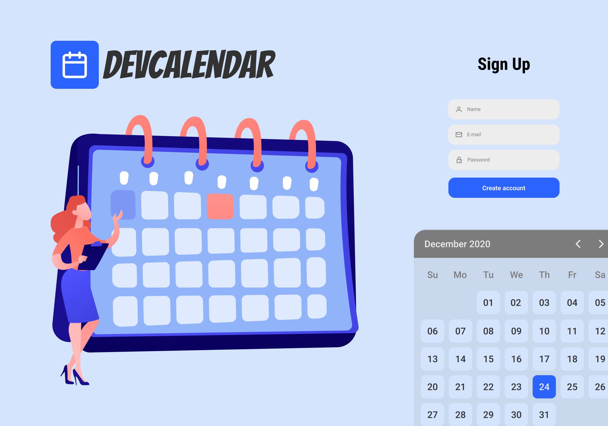

<h1 align="center">
	
</h1>

The best way to organize events' dates!

  

  

  	

## Hello! I made some changes, and there is no code here.

To make this project more organized, I moved the applications (rest api, web client) to 2 different repositories.

Here are the links to them:

- [REST API](https://github.com/AlexsandroBezerra/devcalendar-server)
- [Web client](https://github.com/AlexsandroBezerra/devcalendar-web)

#### [Click here](https://www.figma.com/file/9y1cBfLLcGCI9PPB3UwHJL/DevCalendar?node-id=33%3A0) to open the web layout on Figma.

## 📝 License

This project is licensed under the MIT License - see the [LICENSE](LICENSE) file for details.

---

Made with :purple_heart: by Alexsandro G Bezerra 👋 &nbsp;[See my Linkedin](https://www.linkedin.com/in/alexsandrobezerra)
